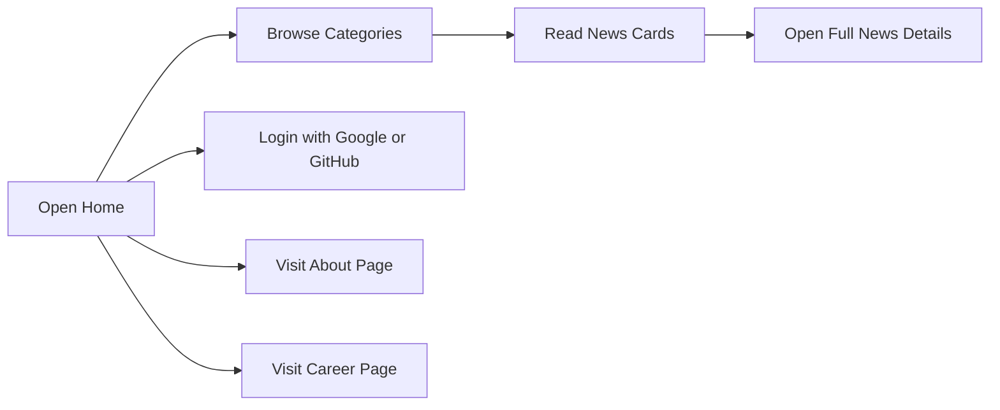

# NewsJournal

<p align="center">
  
</p>

<p align="center">
  A modern news portal built with Next.js, polished UI components, category-based browsing, and social authentication.
</p>

## Overview

NewsJournal is a responsive news website focused on clean reading, category-based discovery, and a more polished editorial feel. It includes styled homepage sections, animated UI details, dedicated About and Career pages, and login support with Google and GitHub.

## Visual Highlights

- Editorial-style homepage with refined typography and subtle reveal animations
- Right sidebar with Google-style social sign-in treatment
- Dedicated About and Career sections with branded content blocks
- Loading skeletons for smoother perceived performance
- Breaking news marquee for fast headline scanning

## Tech Stack

- `Next.js 16`
- `React 19`
- `Tailwind CSS 4`
- `HeroUI`
- `DaisyUI`
- `better-auth`
- `@better-auth/mongo-adapter`
- `MongoDB`
- `Google Auth`
- `GitHub Auth`
- `react-loading-skeleton`
- `react-fast-marquee`
- `react-icons`
- `date-fns`

## Features

- Browse news by category
- View detailed news pages
- Sign in with Google
- Sign in with GitHub
- Responsive layout for desktop and mobile
- Skeleton loading states
- Breaking news marquee component
- Styled About and Career pages
- Clean hover effects and reveal animations

## Workflow



## Project Structure

```bash
src/
  app/
    (main)/
      about-us/
      career/
      category/[id]/
      news/[id]/
  components/
    homepage/news/
    shared/
  lib/
  assets/
```

## Getting Started

```bash
npm install
npm run dev
```

Then open `http://localhost:3000`.

## Main Packages Used

- `@heroui/react`
- `@heroui/styles`
- `better-auth`
- `mongodb`
- `tailwindcss`
- `daisyui`
- `react-loading-skeleton`
- `react-fast-marquee`

## Notes

- Social login is wired for `Google` and `GitHub`
- UI styling combines `Tailwind CSS`, `HeroUI`, and `DaisyUI`
- Loading states use `react-loading-skeleton`
- Headline ticker uses `react-fast-marquee`

